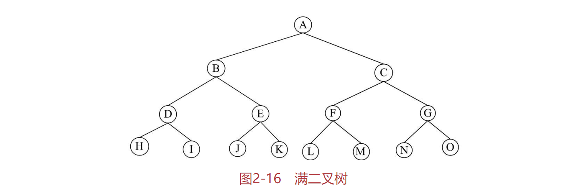
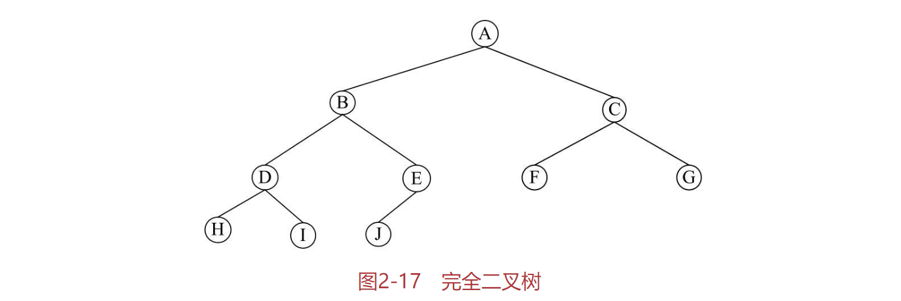
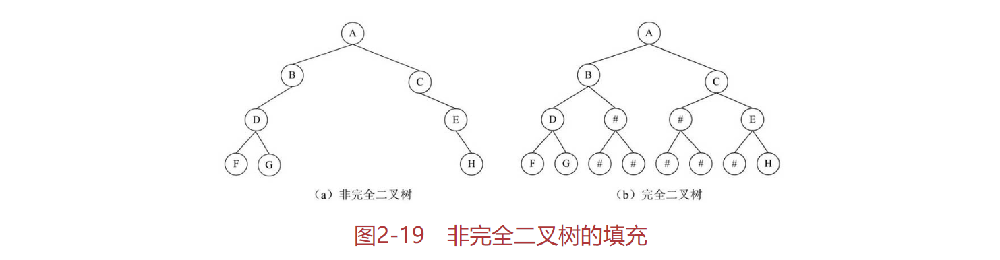

# 树结构
Author & Note ：影风远sinkfarli

Create Date ：2022.6.13

一个国家的行政机构、一个家族的家谱等。这些问题有一个共同点，就是可以表示成一个层次关系。这种层次关系可以抽象为树结构。

## 什么是树结构？
树（Tree）结构是一种描述非线性层次关系的数据结构，其中重要的是树的概念。

树是n个数据结点的集合，在该集合中包含一个根结点，根结点之下则分布着一些互不交叉的子集合，这些子集合也是根结点的子树。树结构的基本特征如下：
- 在一个树结构中，有且仅有一个结点没有直接前驱（与其直接相连的前一个数据元素），这个结点就是树的根结点。
- 除根结点外，其余每个结点有且仅有一个直接前驱。
- 每个结点可以有任意多个直接后继（与其直接相连的后一个数据元素）。

树的定义可以看出，树具有一种层次结构的性质。而从数学的角度来看，树具有一种递归的特性。在树中的每个结点及其之后的所有结点构成一个子树，这个子树也包括根结点。

## 树的基本概念
父结点和子结点：每个结点的子树的根称为该结点的子结点，相应地，该结点被称为子结点的父结点。

兄弟结点：具有同一父结点的结点称为兄弟结点。

结点的度：一个结点所包含子树的数量。

树的度：是指该树所有结点中最大的度。

叶结点：树中度为零的结点称为叶结点或终端结点。

分支结点：树中度不为零的结点称为分支结点或非终端结点。

结点的层数：结点的层数从树根开始计算，根结点为第1层、依次向下为第2、3、…、n层。树是一种层次结构，每个结点都处在一定的层次上。

树的深度：树中结点的最大层数称为树的深度。有序树：若树中各结点的子树（兄弟结点）是按一定次序从左向右安排的，称为有序树。

无序树：若树中各结点的子树（兄弟结点）未按一定次序安排，称为无序树。

森林（forest）：n（n>0）棵互不相交的树的集合。

# 二叉树
在树结构中，二叉树是最简单的一种形式。在研究树结构时，二叉树是重点。因为二叉树的描述相对简单，处理也相对简单，而且更为重要的是，任意的树都可以转换成对应的二叉树。因此，二叉树是所有树结构的基础。

## 什么是二叉树
二叉树是树结构的一种特殊形式，它是n个结点的集合，每个结点最多只能有两个子结点。二叉树的子树仍然是二叉树。二叉树一个结点上对应的两个子树分别称为左子树和右子树。由于子树有左右之分，因此二叉树是有序树。

从这个定义可以看出，在普遍的树结构中，结点的最大度数没有限制，而二叉树结点的最大度数为2。另外，树结构中没有左子树和右子树的区分，而二叉树中则有这个区别。

另外，依照子树的位置的个数，二叉树还有以下几种形式：
- 只有一个子结点且位于左子树位置，右子树位置为空。
- 只有一个子结点且位于右子树位置，左子树位置为空。
- 具有完整的两个子结点，也就是左子树和右子树都存在。

对于一般的二叉树来说，在树结构中可能包含上述的各种形式。按照上述二叉树的这几种形式来看，为了研究的方便，二叉树还可以进一步细分为两种特殊的类型，满二叉树和完全二叉树。

对于满二叉树，就是在二叉树中除最下一层的叶结点外，每层的结点都有2个子结点。典型的满二叉树如图2-16所示。

对于完全二叉树，就是在二叉树中除二叉树最后一层外，其他各层的结点数都达到最大个数，且最后一层叶结点按照从左向右的顺序连续存在，只缺最后一层右侧若干结点。典型的完全二叉树如图2-17所示。

从上面的满二叉树和完全二叉树的定义可以看出，满二叉树一定是完全二叉树，而完全二叉树不一定是满二叉树，因为没有达到完全满分支的结构。

## 完全二叉树的性质
完全二叉树是二叉树中树结构研究的重点。对于完全二叉树来说，如果树中包含n个结点，假设这些结点按照顺序方式存储。那么，对于任意一个结点m来说，具有如下性质：
- 如果m！=1，则结点m的父结点的编号为m/2。
- 如果2m≤n，则结点m的左子树根结点的编号为2m；若2m>n，则无左子树，进一步也就没有右子树。
- 如果2m+1≤n，则结点m的右子树根结点编号为2m+1；若2m+1>n，则无右子树。
- 另外，对于该完全二叉树来说，其深度为[log2n]+1。

这些基本性质展示了完全二叉树结构上的一些特点，在完全二叉树的存储方式及运算处理上都有重要意义。

按照数据的存储方式，树结构可以分为顺序存储结构和链式存储结构两种。接下来分别讨论这两种存储方式的实现。

## 二叉树的顺序存储
顺序存储方式是最基本的数据存储方式。与线性表类似，树结构的顺序存储一般也是采用一维结构数组来表示，关键是定义合适的次序来存放树中各个层次的数据。

先来看完全二叉树的顺序存储。如图2-18所示，这是一个典型的完全二叉树。每个结点的数据为字符类型。如果采用顺序存储方式，可以将其按层来存储。也即先存储根结点，然后从左至右依次存储下一层结点的数据，直到所有的结点数据完全存储。图2-18右侧展示了这种存储的形式。

可以根据前面介绍的完全二叉树的性质来推算各个结点之间的位置关系。
- 对于结点D，位于数组的第4个位置，则其父结点的编号为4/2=2，也就是结点B。
- 结点D左子结点的编号为2×4=8，也就是结点H。
- 结点D右子结点的编号为2×4+1=9，也就是结点I。

对于非完全二叉树的存储要稍微复杂一些。为了仍然可以使用上述简单有效的完全二叉树的性质，往往将一个非完全二叉树填充为一个完全二叉树，如图2-19所示。图（a）为一个典型的非完全二叉树，将缺少的部分填上一个空的数据结点来构成图（b）的完全二叉树。

这样，再按照完全二叉树的顺序存储方式来存储，如图2-20所示。下面便可以按照前述的规则来推算结点之间的关系了。

这种存储方式有很大的缺点，就是浪费存储空间，这是因为其中填充了大量的无用数据。因此，顺序存储方式一般只适用于完全二叉树的情况。对于更为一般的情况，建议采用链式存储方式。

## 二叉树的链式存储
与线性结构的链式存储类似，二叉树的链式存储结构包含结点元素以及分别指向左子树和右子树的指针。典型的二叉树的链式存储结构如图2-21所示。

