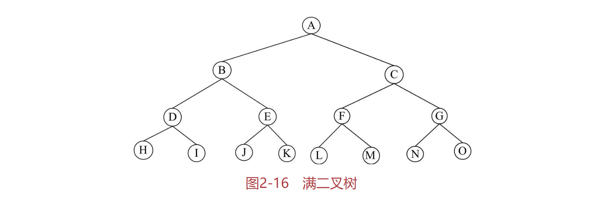
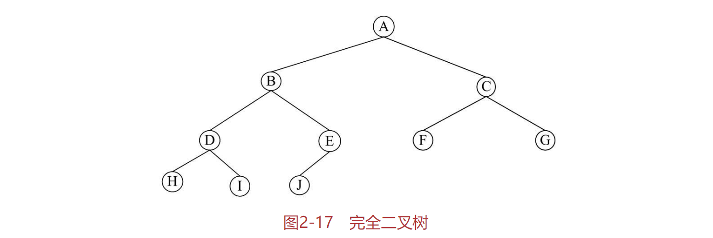

# 树结构
Author & Note ：影风远sinkfarli

Create Date ：2022.6.13

一个国家的行政机构、一个家族的家谱等。这些问题有一个共同点，就是可以表示成一个层次关系。这种层次关系可以抽象为树结构。

## 什么是树结构？
树（Tree）结构是一种描述非线性层次关系的数据结构，其中重要的是树的概念。

树是n个数据结点的集合，在该集合中包含一个根结点，根结点之下则分布着一些互不交叉的子集合，这些子集合也是根结点的子树。树结构的基本特征如下：
- 在一个树结构中，有且仅有一个结点没有直接前驱（与其直接相连的前一个数据元素），这个结点就是树的根结点。
- 除根结点外，其余每个结点有且仅有一个直接前驱。
- 每个结点可以有任意多个直接后继（与其直接相连的后一个数据元素）。

树的定义可以看出，树具有一种层次结构的性质。而从数学的角度来看，树具有一种递归的特性。在树中的每个结点及其之后的所有结点构成一个子树，这个子树也包括根结点。

## 树的基本概念
父结点和子结点：每个结点的子树的根称为该结点的子结点，相应地，该结点被称为子结点的父结点。

兄弟结点：具有同一父结点的结点称为兄弟结点。

结点的度：一个结点所包含子树的数量。

树的度：是指该树所有结点中最大的度。

叶结点：树中度为零的结点称为叶结点或终端结点。

分支结点：树中度不为零的结点称为分支结点或非终端结点。

结点的层数：结点的层数从树根开始计算，根结点为第1层、依次向下为第2、3、…、n层。树是一种层次结构，每个结点都处在一定的层次上。

树的深度：树中结点的最大层数称为树的深度。有序树：若树中各结点的子树（兄弟结点）是按一定次序从左向右安排的，称为有序树。

无序树：若树中各结点的子树（兄弟结点）未按一定次序安排，称为无序树。

森林（forest）：n（n>0）棵互不相交的树的集合。

# 二叉树
在树结构中，二叉树是最简单的一种形式。在研究树结构时，二叉树是重点。因为二叉树的描述相对简单，处理也相对简单，而且更为重要的是，任意的树都可以转换成对应的二叉树。因此，二叉树是所有树结构的基础。

## 什么是二叉树
二叉树是树结构的一种特殊形式，它是n个结点的集合，每个结点最多只能有两个子结点。二叉树的子树仍然是二叉树。二叉树一个结点上对应的两个子树分别称为左子树和右子树。由于子树有左右之分，因此二叉树是有序树。

从这个定义可以看出，在普遍的树结构中，结点的最大度数没有限制，而二叉树结点的最大度数为2。另外，树结构中没有左子树和右子树的区分，而二叉树中则有这个区别。

另外，依照子树的位置的个数，二叉树还有以下几种形式：
- 只有一个子结点且位于左子树位置，右子树位置为空。
- 只有一个子结点且位于右子树位置，左子树位置为空。
- 具有完整的两个子结点，也就是左子树和右子树都存在。

对于一般的二叉树来说，在树结构中可能包含上述的各种形式。按照上述二叉树的这几种形式来看，为了研究的方便，二叉树还可以进一步细分为两种特殊的类型，满二叉树和完全二叉树。

对于满二叉树，就是在二叉树中除最下一层的叶结点外，每层的结点都有2个子结点。典型的满二叉树如图2-16所示。

对于完全二叉树，就是在二叉树中除二叉树最后一层外，其他各层的结点数都达到最大个数，且最后一层叶结点按照从左向右的顺序连续存在，只缺最后一层右侧若干结点。典型的完全二叉树如图2-17所示。

从上面的满二叉树和完全二叉树的定义可以看出，满二叉树一定是完全二叉树，而完全二叉树不一定是满二叉树，因为没有达到完全满分支的结构。

## 完全二叉树的性质

